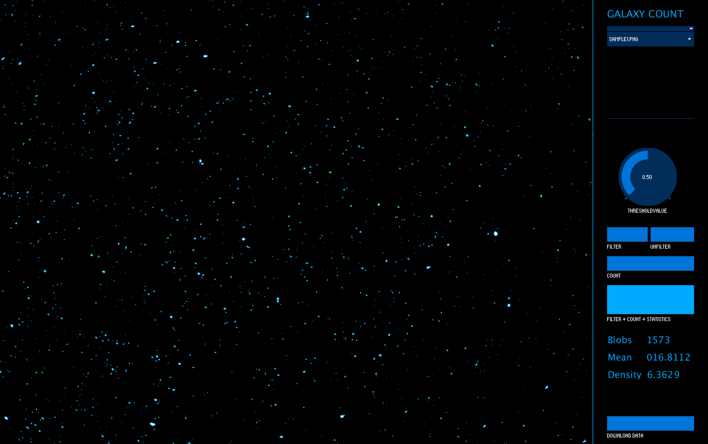
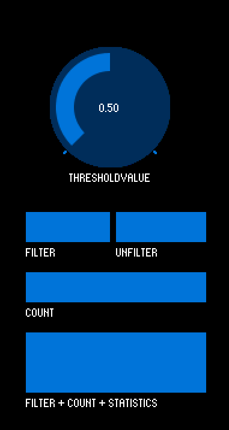

# Galaxy Count

Galaxy Count is a computer vision tool to perform object detection and basic statistical analysis on image sets.
 
It is a [Processing](https://processing.org/) application and its user interface makes it easy to load images, filter them, count objects or "blobs" in each image, and save the computed statistics in CSV format.





A custom version of the app was used by scientists at the State University of New York in Fredonia to analyze micro plastics in global bottled water. 

The story was reported in [Plus Plastic](https://orbmedia.org/stories/plus-plastic) by [Orb Media](https://orbmedia.org/) and was featured on [BBC News](https://www.bbc.com/news/science-environment-43388870) and [CBC](https://www.cbc.ca/news/technology/bottled-water-microplastics-1.4575045) and was covered by [the Guardian](https://www.theguardian.com/environment/2018/mar/15/microplastics-found-in-more-than-90-of-bottled-water-study-says), and [Gizmodo](https://gizmodo.com/report-finds-microplastic-in-93-of-bottled-water-teste-1823798652).


## Setup

Galaxy Count runs on Processing 3. You can download it and follow installation instruction [here](https://processing.org/download/).

It uses the libraries [controlP5](http://www.sojamo.de/libraries/controlP5/) and [blobscanner](https://github.com/robdanet/blobscanner). 

You can install them manually by copying them from the folder `libs` in this repository to the folder `Processing/libraries/` on your machine or from the Processing application's menu in `Sketch > Add Library`. Processing explains how to install a library in more detail [here](https://processing.org/reference/libraries/). 


## How to Use It?

Copy the folder `galaxyCount` to your Processing folder, and add your images to the enclosed folder `data/samples/` in .jpg or .png format.

The expected image size is __2048 × 1536__ px.

Open the sketch in Processing and you can select images from the dropdown. 


#### Controls



Let's go through what the controls let's you do:

* __Threshold Value__ sets the value for the threshold filter


* __Filter__ applies a threshold filter to the current image
* __Unfilter__ undo the filter and show the original image


* __Count__ counts the number of objects or "blobs" in the image, highlights them in blue, and displays the result below


* __Filter + Count + Statistics__ applies filter, counts blobs, and performs basic stats on the counted blobs


* __Download Data__ saves the results for all the processed photos in CSV format in the folder `/data/` with the current date and time.


#### Statistics

The **Filter + Count + Statistics** function displays only a sample of the calculated stats: 

* the number of objects
* the average size of objects (in pixels)
* and the density which is 1000 times the ratio of the area of objects to the total image area i.e. 


The saved statistics data include more measures (all in pixels)
* the standard deviation of object sizes
* the size of smallest object
* the size of biggest object
* the median size of objects


#### Custom Image Size

The width of the input images can be adjusted by editing `galaxyCount.pde` at the line

```processing
int imgWOriginal = 2048;
```

but the aspect ratio of the images is a fixed landscape at 4 : 3. 

## Thanks

To Dan Morrsion and Sherri Mason for the help in testing this code and refining it.

## License

MIT 2018

Basically, you can do whatever you want as long as you include the original copyright and license notice in any copy of the software/source. 

If you use this code in a project, I would love to hear from you. Email me at youssef.faltas@gmail.com 

